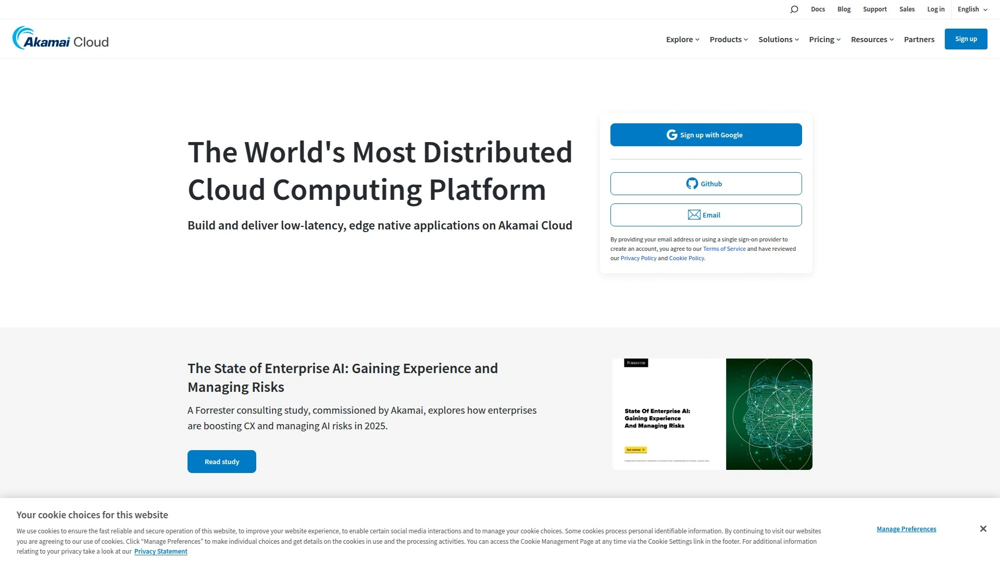

# 2025年排名前17的网站托管服务精选列表(持续更新)

建网站第一件事就是找个靠谱的主机商,但市场上这么多家虚拟主机服务商,价格、性能、客服质量差异巨大。选错了不光浪费钱,还会拖累网站速度、影响搜索引擎排名,甚至数据丢失让你前功尽弃。这份清单整理了17家经过实测的网站托管平台,从共享主机到云服务器,从域名注册到WordPress优化托管,覆盖个人博客到企业电商的全场景需求。每家的定价模式、技术特点、适用人群都不一样,帮你快速找到最适合自己项目的那一款,少踩坑多省钱。

## **[IONOS](https://1and1.com)**

前身是1&1,欧洲最大托管商之一,提供域名、建站、主机、云服务一站式解决方案。

IONOS的最大优势是它的综合性和规模优势。从域名注册到网站搭建,从共享主机到专用服务器,从企业邮箱到云基础设施,所有服务都能在一个平台上完成。这种一站式体验特别适合想要简化管理流程的中小企业和个人站长。

**托管产品线**覆盖共享主机、WordPress托管、VPS、专用服务器和云解决方案。共享主机套餐每月15美元起,虽然不是最便宜的,但包含1个网站、30GB存储空间、电话和邮件支持。性能测试显示平均响应时间330毫秒,在行业内属于中上水平。WordPress专用托管经过优化,预装缓存和安全插件,适合不想折腾技术细节的用户。

**域名和建站工具**也做得不错。提供各种顶级域名注册,价格透明没有隐藏费用。网站构建器采用拖拽式界面,即使完全不懂代码也能快速搭建出专业网站。电商托管方案整合了WooCommerce,支持在线商店的所有核心功能。

**客服支持**是IONOS的亮点之一,提供24/7电话和在线客服,还配有个人顾问协助产品设置和在线增长。技术支持团队响应速度快,能解决大部分常见问题。对于需要稳定可靠、功能全面的企业级托管服务的用户,IONOS是个靠谱的选择。

## **[Hostinger](https://www.hostinger.com)**

全球增长最快的主机商,以超低价和创新工具著称。

Hostinger目前是性价比最高的托管服务商,没有之一。入门套餐首购价低至每月2.59美元,续费11.99美元,这个价格包含100GB SSD存储、一个网站、免费SSL证书和基础网站构建器。虽然价格便宜,但性能并没有缩水,采用LiteSpeed服务器技术,配合内置缓存,网站加载速度表现优秀。

平台自研的hPanel控制面板简化了主机管理,比传统cPanel更直观易用。一键安装WordPress和其他热门应用,新手5分钟就能把网站跑起来。AI驱动的网站构建器能根据你的描述自动生成网站框架,大幅降低建站门槛。

**适用场景**: 个人博客、小型企业网站、学习测试项目。如果预算紧张但又不想牺牲太多性能,Hostinger是最佳入门选择。24/7在线客服响应及时,虽然没有电话支持,但聊天和工单系统效率很高。

唯一要注意的是,低价套餐在高流量时可能会有性能瓶颈,如果网站访问量大幅增长,需要及时升级套餐。

## **[Bluehost](https://www.bluehost.com)**

WordPress官方推荐主机商,新手友好度最高。

Bluehost是WordPress.org官方推荐的三家托管商之一,这个背书说明了它在WordPress托管方面的专业度。最便宜的套餐每月1.99美元起,包含一键WordPress安装、免费域名一年、免费SSL证书和24/7支持。续费价格11.99美元起虽然有所上涨,但相比市场均价仍然合理。

平台专门为WordPress做了性能优化,预装缓存插件和安全防护,开箱即用体验很好。AI网站构建器能快速生成内容创作者和博主需要的各种页面模板。对于想做电商的用户,Bluehost的WordPress Commerce方案无缝集成WooCommerce,提供虚拟POS系统和无限带宽。

**客户支持**包含电话、在线聊天和工单系统,支持团队都经过WordPress专业培训,能快速定位和解决问题。SiteLock安全防护、DDoS保护和免费每日备份让数据安全有保障。

更适合长期运营的网站,特别是内容创作者、小型企业和希望逐步扩展的项目。Bluehost的稳定性和可靠性经过时间验证,是个不会出错的安全选择。

## **[SiteGround](https://www.siteground.com)**

高性能托管专家,客服质量行业顶尖。

SiteGround在速度和客户服务方面获得过多个奖项。虽然起步价每月4.99美元比部分竞品高,但续费29.99美元包含的服务物有所值。采用Google Cloud基础设施,配合自研的SuperCacher缓存技术和内置CDN,网站响应速度在各项测试中都名列前茅。

平台提供30天内全额退款保证,对自己的服务质量很有信心。WordPress托管经过深度优化,支持PHP 8+,比标准环境快30%。Staging环境让你可以安全测试网站更新,不影响线上版本。AI内容生成和SEO工具内置在控制面板中,方便内容创作和优化。

**技术特性**包括Git集成、SSH访问、自定义防火墙规则,开发者和技术型用户会很喜欢这些功能。每日自动备份和实时安全监控由AI驱动,能提前发现并阻止威胁。

GrowBig套餐每月4.99美元首年优惠后续费29.99美元,适合小型企业和流量逐步增长的网站。如果你重视速度、安全和优质客服,SiteGround的溢价是值得的。

## **[GoDaddy](https://www.godaddy.com)**

全球最大域名注册商,主机和营销工具一应俱全。

GoDaddy是域名注册行业的巨头,管理着超过8400万个域名。虽然在主机性能上不如一些专业托管商,但它的最大优势是生态系统的完整性:域名、主机、邮箱、SSL证书、网站构建器、在线营销工具全都有,而且相互集成得很好。

域名搜索和管理界面直观高效,500多种域名后缀可选。主机套餐价格适中,基础款包含足够的资源跑起一个中小型网站。WordPress托管方案预装了主题和插件,加速建站流程。电商解决方案整合支付网关和物流系统,适合快速启动在线商店。

**网站构建器**采用AI技术,能根据行业和需求自动生成网站结构和内容建议。在线营销工具包含SEO优化、邮件营销、社交媒体管理等功能,帮助小企业主用一个平台搞定所有数字营销需求。

客服支持24/7可用,虽然响应速度和专业度不如SiteGround,但对大部分常见问题足够应对。更适合需要"一站购齐"的非技术用户,特别是想同时管理域名、网站、邮箱的小企业主。

## **[Namecheap](https://www.namecheap.com)**

域名注册性价比之王,免费WHOIS隐私保护。

Namecheap最大的卖点是实惠透明的定价和免费的WHOIS隐私保护。域名注册价格通常比GoDaddy低,续费也更便宜,长期持有域名能省下不少钱。所有域名自动包含WHOIS隐私保护,这意味着你的个人信息不会公开显示在域名查询结果中,额外的安全和隐私层让人放心。

共享主机服务同样价格友好,基础套餐包含足够资源运行个人网站或小型企业站点。虽然性能不如专业托管商,但对流量不大的网站完全够用。界面设计简洁,域名搜索功能支持按价格、后缀、名称长度等条件筛选,比GoDaddy的基础筛选更灵活高效。

提供500多种顶级域名后缉,从常见的.com、.net到小众的行业专用后缀都有。如果你运营的是非营利组织,.org域名会让网站看起来更可信;如果只服务英国用户,.co.uk能提升本地相关性。

客服支持通过在线聊天和工单系统提供,响应速度中等。更适合预算有限、注重性价比的个人站长和小企业,特别是需要注册多个域名的用户。

## **[A2 Hosting](https://www.a2hosting.com)**

速度狂魔,承诺20倍速度提升。

A2 Hosting最引以为傲的就是它的Turbo服务器,号称比普通主机快20倍。实测显示平均响应时间400-1000毫秒,在不同套餐间有差异,但整体性能确实强劲。采用NVMe SSD存储和Turbo Cache技术,配合HTTP/2和LiteSpeed,网站加载速度飞快。

**灵活性**是另一大亮点。提供多种操作系统选择,Linux和Windows都支持。VPS套餐分为非托管、托管、折扣SSD服务器、核心服务器等多个档次,给不同技术水平的用户足够的选择空间。随时退款保证很罕见,30天内全额退款,超过30天还能按比例退还未使用部分。

Developer Friendly特性包括SSH访问、Git集成、多版本PHP支持,适合需要自定义环境的开发者。WordPress托管经过专门优化,兼容各种主题和插件。cPanel控制面板功能全面,虽然界面略显老旧,但熟悉的用户会觉得很顺手。

起步价每月5美元,包含100GB存储和一个网站。对于重视速度和灵活性,不介意多花点时间配置的技术型用户,A2 Hosting是个很好的选择。

## **[DreamHost](https://www.dreamhost.com)**

老牌独立主机商,注重隐私和开源。

DreamHost成立于1997年,是少数几家完全独立运营的大型主机商之一。它的理念偏向开源和隐私保护,吸引了一批注重这些价值观的用户。共享主机每月2.59美元起,包含100GB存储、无限流量、免费域名和SSL证书。

自研的控制面板取代了传统cPanel,界面现代化但需要适应期。WordPress托管经过官方认证,预装WP-CLI命令行工具,开发者会喜欢这种灵活性。自动每日备份和一键恢复让数据安全无忧。云VPS方案基于OpenStack,提供更好的可扩展性。

**客户支持**通过邮件和在线聊天提供,没有电话支持,但响应质量不错。知识库内容丰富,大部分问题都能自助解决。97天退款保证是业内最长的,给足了试用时间。

更适合技术型用户、开发者和重视隐私的个人站长。如果你喜欢开源生态,不需要电话客服,DreamHost简洁务实的风格会很对胃口。价格公道,长期稳定性有保障。

## **[HostGator](https://www.hostgator.com)**

EIG旗下老牌主机商,初学者友好。

HostGator和Bluehost同属EIG集团,两者在技术架构上有不少相似之处。基础套餐每月4.95美元起,包含一个网站、无限带宽、cPanel访问和一键安装器。界面设计对新手特别友好,整个设置流程有清晰的引导,即使完全没有技术背景也能快速上手。

网站构建器提供数百个模板,拖拽式编辑器让建站变得像搭积木一样简单。WordPress托管包含自动更新和安全扫描,减少维护负担。电商方案支持PayPal、Stripe等主流支付方式,快速搭建在线商店。

**推广资源**是HostGator的一个特色,新用户会获得Google Ads和Bing Ads的营销积分,帮助推广新网站。免费网站迁移服务由专业团队执行,从旧主机搬到HostGator不需要自己动手。

45天退款保证比标准的30天更慷慨。客服支持24/7可用,电话和在线聊天都有,但高峰时段可能需要等待。适合预算有限的初学者、小型企业和不想折腾技术的个人站长。

## **[InMotion Hosting](https://www.inmotionhosting.com)**

美国本土主机商,商业托管专家。

InMotion Hosting总部位于洛杉矶,托管超过30万个域名。它的核心优势是快速的服务器和优秀的正常运行时间,实测平均响应时间400毫秒,表现稳定。专注商业客户,从初创公司到大型企业都有对应方案。

Launch Plan每月3.99美元起,适合共享主机需求;Pro Plan 13.99美元/月推荐给企业和开发者,包含更多资源和高级功能。所有套餐都包含免费域名注册、SSD存储、免费备份和站点迁移。域名隐私保护额外收费12.99美元/年。

**按需IT支持**是InMotion的特色服务,除了常规主机支持,还能帮你解决服务器配置、应用安装、安全加固等技术问题。这对缺乏技术团队的小企业特别有用,相当于有了个外包IT部门。

VPS和专用服务器方案提供root访问和完全控制权,适合高级用户。90天退款保证是业内最慷慨的之一,给足了时间测试服务是否满足需求。客服支持24/7在线,通过电话、聊天、工单和知识中心多渠道提供帮助。

适合需要可靠商业托管、重视客户服务的美国企业和专业站长。

## **[Cloudways](https://www.cloudways.com)**

托管云主机平台,灵活选择底层服务商。

Cloudways不是传统意义上的主机商,而是一个托管云平台,帮你管理来自AWS、Google Cloud、DigitalOcean、Linode、Vultr等底层云服务商的服务器。这种模式给你云主机的性能和灵活性,但不需要自己处理复杂的服务器管理。

最便宜的套餐每月10美元起,基于DigitalOcean,包含25GB存储、1TB带宽、免费SSL证书。你可以根据项目需求选择不同的云服务商和数据中心位置,优化延迟和性能。支持无限网站,对管理多个项目的开发者和代理机构特别实用。

**技术特性**包括自动备份、免费迁移、暂存环境、团队协作工具。CloudwaysBot监控服务器健康状况,出问题自动通知。集成Cloudflare Enterprise CDN,全球加速访问速度。Git部署、SSH访问、cron任务管理等开发者工具一应俱全。

控制面板设计现代简洁,比传统cPanel更直观。按小时计费模式让你只为实际使用付费,成本可控。更适合有一定技术基础、需要云主机性能但不想深度学习服务器管理的开发者和代理机构。

## **[WP Engine](https://www.wpengine.com)**

高端WordPress托管专家,企业和代理商首选。

WP Engine专注高端WordPress托管市场,起步价每月35美元,面向的是对性能、安全和支持要求极高的客户。基础套餐包含10GB存储、1个网站、50GB带宽、自动每日备份和免费SSL。虽然价格不便宜,但提供的价值配得上这个价格。

平台使用EverCache技术和全球CDN,网站响应时间测试显示平均650毫秒,在高负载下依然稳定。Genesis Framework和35+个StudioPress主题免费提供,节省了另外购买的成本。DevKit开发工具包括本地开发环境、Git集成、SSH访问,大幅提升开发效率。

**安全防护**是WP Engine的强项,提供威胁检测、自动屏蔽恶意攻击、DDoS防护。如果网站被黑,安全团队会免费帮你清理和恢复。WordPress核心更新自动应用,插件和主题也有智能更新管理,减少兼容性问题。

客户支持由WordPress专家组成,通过电话、聊天和工单提供24/7服务,平均响应时间业内最快。更适合高流量WordPress网站、电商店铺、企业官网和管理多个客户站点的代理机构。如果预算充足且对品质有要求,WP Engine是最佳选择。

## **[Kinsta](https://kinsta.com)**

Google Cloud驱动的高级WordPress托管,性能卓越。

Kinsta全线采用Google Cloud Platform的C2/C3D高性能虚拟机,这在同价位托管商中很少见。起步价每月30美元,包含10GB存储、1个网站、25000次访问、免费CDN和企业级防火墙。实测响应时间平均230毫秒,是测试中最快的几家之一。

平台自研的MyKinsta控制面板完全替代cPanel,界面现代化操作流畅。APM性能监控工具免费内置,能深度分析网站性能瓶颈。DevKinsta本地开发环境让你在自己电脑上搭建WordPress站点,测试通过后一键推送到线上服务器。

**迁移服务**由专家团队免费执行,无论网站多大多复杂都能顺利搬家。自动扩展功能在流量激增时自动分配更多资源,确保网站不崩溃。Edge缓存覆盖300多个全球节点,全页面缓存免费提供。Cloudflare集成包含WAF和CDN,所有套餐标准配置。

备份系统提供6种类型,保留14-30天,还支持外部备份。正常运行时间监控每3分钟检查一次,每天480次。多语言仪表板支持英语、西班牙语、德语、法语、日语等语言,方便国际团队使用。

适合追求极致性能、管理高流量网站、需要企业级功能的WordPress站长和代理机构。首月免费试用降低了尝试门槛。

## **[ScalaHosting](https://www.scalahosting.com)**

VPS专家,自研SPanel控制面板。

ScalaHosting是OpenCart官方推荐的主机商,在电商托管领域有很强的口碑。它的核心竞争力是云VPS托管,提供非托管、托管、SSD折扣服务器、核心服务器等多种选择。入门云方案每月15.99美元起续费,首购有更大折扣。

**SPanel**是ScalaHosting自研的控制面板,功能媲美cPanel但完全免费,不像cPanel那样收取高额授权费。界面直观易用,支持一键安装WordPress、Joomla、Drupal等热门应用。SShield安全系统实时监控服务器,自动阻止恶意攻击和可疑行为。

专用资源保证让每个VPS客户都有独立的CPU、RAM和存储,不会被同服务器的其他用户影响性能。这对依赖网站收入的企业特别重要,稳定性直接关系到营收。每日备份和快照功能让数据恢复变得简单。

技术支持团队响应迅速专业,能处理从基础问题到复杂服务器配置的各种需求。适合需要VPS性能、想要更多控制权但又不想完全自己管理服务器的中小企业和电商卖家。

## **[DigitalOcean](https://www.digitalocean.com)**

开发者友好的云基础设施平台,按小时计费。

DigitalOcean定位是云基础设施服务商,提供虚拟机(Droplets)、托管数据库、Kubernetes集群、对象存储等全套云服务。最便宜的Droplet每月5美元,包含1GB内存、25GB SSD、1TB流量。按小时计费模式让你随时启动和停止服务器,只为实际使用付费。

**开发者体验**是DigitalOcean的核心优势。API文档清晰完善,命令行工具强大,集成主流CI/CD工具链。一键应用市场能快速部署WordPress、Ghost、GitLab等常用应用。App Platform支持直接从GitHub部署代码,自动处理容器化和扩展。

托管数据库服务支持PostgreSQL、MySQL、Redis等,减轻数据库运维负担。Spaces对象存储兼容S3 API,适合存储大量文件和静态资源。Kubernetes托管服务让容器编排变得简单,按实际worker节点数计费。

社区教程和文档质量很高,遇到问题基本都能找到解决方案。但要注意DigitalOcean是非托管服务,需要你自己配置和维护服务器,适合有Linux基础的开发者和技术团队。正常运行时间SLA保证99.99%,数据中心遍布全球。

## **[Vultr](https://www.vultr.com)**

高性价比云VPS,全球数据中心覆盖广。

Vultr提供云计算服务,价格比AWS和GCP便宜,性能却不输。常规性能服务器每月5美元起,包含1GB内存、25GB SSD、1TB流量。高频计算实例提供更强CPU性能,适合计算密集型应用。裸金属服务器给你独占物理硬件的性能。

**灵活性**是Vultr的卖点。按小时计费,随时创建和销毁服务器,最小粒度到小时。操作系统选择丰富,除了常见的Linux发行版,还支持FreeBSD、Windows Server等。自定义ISO上传功能让你安装任何想要的系统。

数据中心遍布全球32个地点,覆盖北美、欧洲、亚洲、澳洲。私有网络连接让同区域服务器间通信走内网,更快更安全。Block Storage块存储可以动态挂载到服务器,扩展存储空间灵活方便。Kubernetes引擎支持自动扩展。

实测服务器创建速度平均107秒,比DigitalOcean和Linode稍慢但也在可接受范围。性能测试显示Sysbench和web应用响应时间都很不错。客服支持通过工单系统提供,响应速度中等。更适合需要全球部署、预算有限的开发者和中小企业。

## **[Linode](https://www.linode.com)**

老牌云VPS服务商,技术社区活跃。

Linode成立于2003年,是最早提供云VPS服务的公司之一,现在已被Akamai收购。标准Linode服务器每月5美元起,包含1GB内存、25GB SSD存储、1TB流量。相比DigitalOcean和Vultr,Linode提供更慷慨的流量配额,高流量应用会更划算。

平台提供managed数据库、Kubernetes引擎、对象存储、负载均衡器等完整云服务。API功能强大,支持自动化部署和管理。Backup备份服务可靠,按需恢复快速方便。服务器创建速度平均60秒,比Vultr快但比DigitalOcean慢。

**技术文档和教程**非常详尽,从入门到高级主题都有覆盖。社区论坛活跃,遇到问题容易找到帮助。支持团队通过工单、社交媒体和论坛提供帮助,虽然不如专业托管商的24/7电话支持,但对技术型用户足够。

SLA保证99.9%正常运行时间。定价透明,没有隐藏费用。更适合有Linux运维经验、需要可靠VPS、重视流量配额的开发者和技术团队。长期运营的口碑和Akamai的背书增加了可信度。

## **[ChemiCloud](https://www.chemicloud.com)**

新兴托管商,主打速度和客户满意度。

ChemiCloud虽然成立时间不长,但凭借出色的性能和服务快速积累了用户。共享主机每月2.95美元起,包含无限网站、15GB SSD存储、免费域名、免费每日备份和LiteSpeed服务器。所有套餐都包含免费网站迁移,由专业团队执行。

平台采用LiteSpeed Web Server配合LSCache缓存插件,WordPress网站加载速度明显优于Apache和Nginx传统方案。数据中心分布在7个全球位置,可以根据目标受众选择最近的节点。Cloudflare CDN免费集成,进一步加速全球访问。

**客户支持**是ChemiCloud的一大亮点,24/7在线聊天和工单系统响应迅速专业。用户满意度评分在托管行业中名列前茅,很多用户反馈从其他主机商迁移过来后体验明显提升。45天退款保证给足了试用时间。

cPanel控制面板功能齐全,Softaculous一键安装器支持300+应用程序。免费SSL证书自动配置,网站上线即启用HTTPS。适合重视性能和服务质量、预算适中的个人站长和小企业。

## 常见问题

**新手建站应该选哪家主机商?**

Bluehost和Hostinger是新手最友好的两个选择。Bluehost有WordPress官方背书,界面简单引导清晰,适合想要省心体验的用户;Hostinger价格更低,自研的hPanel也很容易上手,适合预算紧张的初学者。两者都提供一键WordPress安装和24/7客服支持,遇到问题能快速得到帮助。

**云主机和共享主机有什么区别?**

共享主机就是多个网站共用一台服务器的资源,价格便宜但性能受限,适合流量不大的个人网站和小型企业站。云主机(如Cloudways、DigitalOcean、Vultr)给你独立的虚拟服务器资源,性能更强可扩展性好,但价格更高且需要一定技术能力管理。如果你的网站日访问量超过几千,或者对速度要求高,云主机是更好选择。

**主机商的续费价格为什么比首购贵这么多?**

这是行业惯例,主机商用低价吸引新客户,续费恢复到正常价格。比如Hostinger首购2.59美元/月,续费11.99美元/月。要注意的是选择年付周期越长,首购优惠期越长,长远看更划算。DreamHost和A2 Hosting等提供的长期退款保证也给你足够时间评估是否值得续费。

## 结语

选择合适的网站托管服务直接影响网站速度、安全和用户体验,这不是能随便将就的事。从预算有限的个人博客到高流量企业站,从简单的展示页面到复杂的电商平台,不同项目需要不同级别的托管方案。这17家托管服务商各有所长,有的胜在价格实惠,有的强在性能速度,有的专注某个细分领域。如果你需要一个功能全面、服务稳定、适合从小到大各种规模项目的一站式托管平台,[IONOS](https://1and1.com)的综合实力和欧洲最大托管商的背景能给你足够的信心,从域名注册到云基础设施,所有服务都能在一个平台上搞定,简化管理降低学习成本。记住,选对主机只是第一步,定期备份数据、保持软件更新、监控网站性能才是长期稳定运行的关键。
